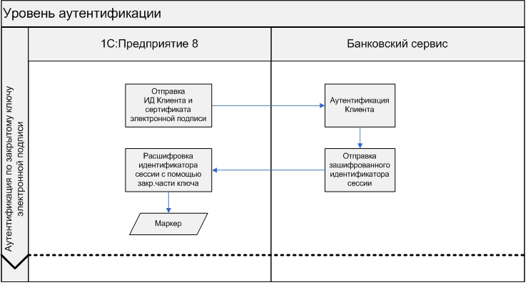

# API прямого обмена данными с банком


API обмена данными – уровень, который описывает подходы и методы осуществления операций обмена данными, он в свою очередь делится на следующие уровни:

- Уровень аутентификации

- Настройка обмена

- Транспортный уровень


- - -

+ [Порядок взаимодействия на уровне аутентификации](#authentication)
	+ [Аутентификация по логину и паролю](#baseAuthentication)

 		+ [Метод **Logon** (HTTP-метод POST)](#logon)
 		
 		+ [Метод **LogonOTP** (HTTP-метод POST)](#logonOTP)
  
     + [Аутентификация по закрытому ключу сертификата](#certAuthentication)

 		+ [Метод **LogonCert** (HTTP-метод POST)](#logonCert)
 		
	+ [Рекомендации для банковского сервиса](#recommendations)

+ [Настройка обмена электронными документами](#installation)

	+ [Получение настроек обмена с банком в автоматическом режиме](#installationGet)

		+ [Метод **GetSettings** (HTTP-метод POST)](#getSettings)

	+ [Пример XML-файла настроек обмена с банком](#exampleSettings)

+ [Порядок взаимодействия на транспортном уровне](#transport)

	+ [Формирование и разбор транспортного контейнера](#transportPacket)

	+ [Отправка электронных документов из 1С](#send)

		+ [Метод **SendPack** (HTTP-метод POST)](#sendPack)

	+ [Получение электронных документов в 1С](#get)

		+ [Метод **GetPackList** (HTTP-метод GET)](#getPackList)

		+ [Метод **GetPack** (HTTP-метод GET)](#getPack)

+ [Проверка работоспособности обмена электронными документами](#test)

	+ [Пример XML-файла запроса-зонда](#zond)

+ [Процедура синхронизации 1С с банковским сервисом](#synchronization)

+ [Обеспечение безопасности данных](../common-section/data-security.md#security)

	+ [Шифрование данных при передаче](../common-section/data-security.md#encryption)

	+ [Криптооперации, выполняемые на стороне Клиента и Банка](../common-section/data-security.md#crypto)

	+ [Защита электронных документов с помощью электронной подписи](../common-section/data-security.md#signature)

+ [Схемы данных](../xsd-scheme/readme.md)

+ [Классификаторы](../common-section/tables.md)

	+ [Таблица кодов статусов транспортных контейнеров](../common-section/tables.md#packet)

	+ [Таблица кодов видов электронных документов](../common-section/tables.md#ed)

	+ [Таблица кодов статусов электронных документов](../common-section/tables.md#status)

	+ [Таблица типов выписок банка](../common-section/tables.md#statementType)

	+ [Таблица кодов ошибок и их описание, которые может возвращать банковский сервис в «1С:Предприятие 8»](../common-section/tables.md#errors)

+ [Описание типов](../common-section/type-tables.md)


- - - -


# <a name="authentication"></a> Порядок взаимодействия на уровне аутентификации.


Аутентификация Клиента с целью создания сессии на сервисе Банка может проходить по логину и паролю + дополнительный OTP («one time password», опционально) ([Logon](#logon)) или по закрытому ключу сертификата ([LogonCert](#logoncert)) . 
Аутентификация по логину и паролю используется для получения настроек из банка, поэтому на сервисе банка данный вид аутентификации должен всегда поддерживаться. В файле настроек можно задать данный способ аутентификации как основной и единственный или указать аутентификацию по закрытому ключу сертификата при дальнейшем обмене.

## <a name="baseAuthentication"></a> Аутентификация по логину и паролю

Система «1С:Предприятия 8» передает в Банк уникальный идентификатор Клиента в банковской системе (строка может содержать только ANSI-символы в соответствии с [RFC 2616](http://tools.ietf.org/html/rfc2616) для передачи значений в HTTP-заголовке) и строку, содержащую «логин + пароль» (строка «Basic логин:пароль» в формате BASE64 в соответствии с [Basic access authentication](http://tools.ietf.org/html/rfc2617)) (отправка производится HTTP-методом POST - метод [Logon](#logon)).

Особенностью данного процесса является то, что в момент первой аутентификации уникальный идентификатор Клиента неизвестен, тогда следует передавать «0».

В случае использования однофакторной аутентификации на стороне Банка и успешного завершения процесса сервис возвращает идентификатор сессии («маркер») в «1С:Предприятия 8» в синхронном режиме (XML-файл, соответствующий [XML-схеме ответа банк.сервиса](../xsd-scheme/readme.md#1C-Bank_ResultBank)).


В случае использования двухфакторной аутентификации на стороне Банка (применение OTP – «one time password») и успешного начала процесса аутентификации сервис в синхронном режиме возвращает в «1С:Предприятия 8» идентификатор сессии, пока еще неавторизованной на стороне Банка, и признак, что требуется расширенная аутентификация (XML-файл, соответствующий [XML-схеме ответа банк.сервиса](../xsd-scheme/readme.md#1C-Bank_ResultBank)), а также направляет OTP на мобильный телефон Клиента.


«1С:Предприятии 8» выводит форму с текстом, содержащим идентификатор неавторизованной сессии и, возможно, маску мобильного телефона Клиента (если Банк ее прислал), и предлагает пользователю ввести OTP.


Система «1С:Предприятия 8» передает в Банк уникальный идентификатор Клиента в банковской системе и введенный OTP (отправка производится HTTP-методом POST - метод LogonOTP). В случае успешного завершения процесса банковский сервис возвращает идентификатор авторизованной сессии в «1С:Предприятия 8» в синхронном режиме (XML-файл, соответствующий [XML-схеме ответа банк.сервиса](../xsd-scheme/readme.md#1C-Bank_ResultBank)).

Особенностью данного процесса является то, что в момент первой аутентификации уникальный идентификатор Клиента неизвестен, тогда следует передавать «0».

В дальнейшем, идентификатор авторизованной сессии будет указан в каждом HTTP-запросе для обмена данными на транспортном уровне (в заголовке SID).


Результатом неуспешной аутентификации должна быть ошибка, возвращаемая банковской системой в синхронном режиме (XML-файл, соответствующий [XML-схеме ответа банк.сервиса](../xsd-scheme/readme.md#1C-Bank_ResultBank)).


### <a name="logon"></a> Метод Logon (HTTP-метод POST) 

Аутентификация по логину и паролю, однофакторная аутентификация


**Заголовки:**

- Host: <Адрес ресурса банка>

- Content-Type: application/xml; charset=utf-8

- CustomerID: <Уникальный идентификатор Клиента, содержащий только ANSI-символы. Передается 0, если CustomerID еще неизвестен>

- Authorization: Basic <логин:пароль>

- APIVersion: <Версия API обмена данными> 

- AvailableAPIVersion: <Доступная версия API обмена данными>


**Тело запроса:**

- ПУСТО


**Успешный ответ:**

- HTTP/1.1 200 OK

- Content-Type: application/xml; charset=utf-8

- Content: < XML-файл, соответствующий [XML-схеме ответа банк.сервиса](../xsd-scheme/readme.md#1C-Bank_ResultBank)>


**Параметры запроса:**


| Параметр      | Тип               | Кратность | Описание                                                         |
|---------------|-------------------|:---------:|------------------------------------------------------------------|
| Host          | [string](../common-section/type-tables.md#string)            | [1]       | Адрес ресурса банка                                              |
| CustomerID    | [string](../common-section/type-tables.md#string)            | [1]       | Уникальный идентификатор Клиента, содержащий только ANSI-символы. Передается 0, если CustomerID еще неизвестен |
| Authorization | [base64Binary](../common-section/type-tables.md#base64Binary)      | [1]       | «логин + пароль» в соответствии с [Basic access authentication](http://tools.ietf.org/html/rfc2617)    |
| APIVersion    | [FormatVersionType](../common-section/type-tables.md#FormatVersionType) | [1]       | Версия API обмена данными                                        |
| AvailableAPIVersion | [FormatVersionType](../common-section/type-tables.md#FormatVersionType) | [0-1]       | Максимальная доступная для текущей информационной базы версия API обмена данными                                                                                                                  |


**Параметры ответа:**


| Параметр                         | Тип               | Кратность | Описание                        |
|----------------------------------|-------------------|:---------:|---------------------------------|
| ResultBank  |  [ResultBank](../common-section/type-tables.md#edo-ResultBank)                 |   [1]                | Ответ банка                                |


**Пример запроса** аутентификации по **логину и паролю**:

```http

POST http://testdirectbank.1c.ru/go/Logon HTTP/1.1
Host: testdirectbank.1c.ru:80
User-Agent: 1C+Enterprise/8.3
Accept: */*
Authorization: Basic ZGVtbzpkZW1v
AvailableAPIVersion: 2.3.2
APIVersion: 2.1.1
CustomerID: 0
Content-Type: application/xml; charset=utf-8

```

**Пример успешного ответа** на запрос аутентификации по **логину и паролю**:

```http
HTTP/1.1 200 OK
Server: nginx
Date: Tue, 27 Apr 2021 11:47:12 GMT
Content-Length: 378
Proxy-Connection: Keep-Alive
Via: 1.1 FWD9
Connection: Keep-Alive
```
```xml
<?xml version="1.0" encoding="UTF-8"?>
<ResultBank xmlns="http://directbank.1c.ru/XMLSchema" xmlns:xs="http://www.w3.org/2001/XMLSchema" xmlns:xsi="http://www.w3.org/2001/XMLSchema-instance" formatVersion="2.3.2" userAgent="DirectBankService">
	<Success>
		<LogonResponse>
			<SID>9b11221a-1bf6-4c34-a46d-ae9bcfdd9928</SID>
		</LogonResponse>
	</Success>
</ResultBank>
```


**Пример успешного ответа** на запрос аутентификации по **логину и паролю + ОТР**:

```http
HTTP/1.1 200 OK
Server: nginx
Date: Tue, 27 Apr 2021 11:53:28 GMT
Content-Length: 464
Proxy-Connection: Keep-Alive
Via: 1.1 FWD9
Connection: Keep-Alive
```
```xml
<?xml version="1.0" encoding="UTF-8"?>
<ResultBank xmlns="http://directbank.1c.ru/XMLSchema" xmlns:xs="http://www.w3.org/2001/XMLSchema" xmlns:xsi="http://www.w3.org/2001/XMLSchema-instance" formatVersion="2.3.2" userAgent="DirectBankService">
    <Success>
        <LogonResponse>
            <SID>5452194f-bb4d-4609-912f-35c849e9e0a3</SID>
            <ExtraAuth>
                <OTP phoneMask="+*********85" code="5452194f"/>
            </ExtraAuth>
        </LogonResponse>
    </Success>
</ResultBank>
```

### <a name="logonOTP"></a> Метод LogonOTP (HTTP-метод POST)

Аутентификация по логину и паролю, двухфакторная аутентификация


**Заголовки:**

- Host: <Адрес ресурса банка>

- Content-Type: application/xml; charset=utf-8

- CustomerID: <Уникальный идентификатор Клиента, содержащий только ANSI-символы. Передается 0, если CustomerID еще неизвестен>

- SID: <Идентификатор неавторизованной сессии>

- OTP: <Пользовательский OTP>

- APIVersion: <Версия API обмена данными>


**Тело запроса:**

- ПУСТО


**Успешный ответ:**

- HTTP/1.1 200 OK

- Content-Type: application/xml; charset=utf-8

- Content: < XML-файл, соответствующий [XML-схеме ответа банк.сервиса](../xsd-scheme/readme.md#1C-Bank_ResultBank)>


**Параметры запроса:**


| Параметр   | Тип               | Кратность | Описание                                                         |
|------------|-------------------|:---------:|------------------------------------------------------------------|
| Host       | [string](../common-section/type-tables.md#string)            | [1]       | Адрес ресурса банка                                              |
| SID        | [IDType](../common-section/type-tables.md#IDType)            | [1]       | Идентификатор неавторизованной сессии                            |
| CustomerID | [string](../common-section/type-tables.md#string)            | [1]       | Уникальный идентификатор Клиента, содержащий только ANSI-символы. Передается 0, если CustomerID еще неизвестен |
| OTP        | [int](../common-section/type-tables.md#int)               | [1]       | Пользовательский OTP - целые числа 6-7 знаков                    |
| APIVersion | [FormatVersionType](../common-section/type-tables.md#FormatVersionType) | [1]       | Версия API обмена данными                                        |


**Параметры ответа:**


| Параметр                         | Тип               | Кратность | Описание                        |
|----------------------------------|-------------------|:---------:|---------------------------------|
| ResultBank  |  [ResultBank](../common-section/type-tables.md#edo-ResultBank)                 |   [1]                | Ответ банка                                |


**Пример запроса** передачи **OTP**:


```http
POST http://testdirectbank.1c.ru/go/LogonOTP HTTP/1.1
Host: testdirectbank.1c.ru:80
User-Agent: 1C+Enterprise/8.3
Accept: */*
APIVersion: 2.1.1
OTP: 111111
SID: 5452194f-bb4d-4609-912f-35c849e9e0a3
CustomerID: 0
Content-Type: application/xml; charset=utf-8
```


**Пример успешного ответа** на запрос передачи **OTP**:

```http
HTTP/1.1 200 OK
Server: nginx
Date: Tue, 27 Apr 2021 11:53:36 GMT
Content-Length: 378
Proxy-Connection: Keep-Alive
Via: 1.1 FWD9
Connection: Keep-Alive
```
```xml
<?xml version="1.0" encoding="UTF-8"?>
<ResultBank xmlns="http://directbank.1c.ru/XMLSchema" xmlns:xs="http://www.w3.org/2001/XMLSchema" xmlns:xsi="http://www.w3.org/2001/XMLSchema-instance" formatVersion="2.1.1" userAgent="DirectBankService">
    <Success>
        <LogonResponse>
            <SID>ca2d4c4c-2cc3-449e-9fe2-25465f878685</SID>
        </LogonResponse>
    </Success>
</ResultBank>
```

## <a name="certAuthentication"></a> Аутентификация по закрытому ключу сертификата
Данный вид аутентификации нельзя использовать на этапе получения настроек из банка.

Система «1С:Предприятия 8» передает в Банк уникальный идентификатор Клиента в банковской системе (строка может содержать только ANSI-символы в соответствии с [RFC 2616](http://tools.ietf.org/html/rfc2616) для передачи значений в HTTP-заголовке), а также  файл открытой части ключа электронной подписи Клиента, импортированный в систему «1С:Предприятие 8» на этапе настроек обмена (отправка производится HTTP-методом POST - метод _LogonCert,_ передается  XML-файл, соответствующий [XML-схеме данных для аутентификации по закр.ключу](../xsd-scheme/readme.md#1C-Bank_AuthSign)).
Банковский сервис по идентификатору клиента, серийному номеру сертификата и имени издателя выполняет поиск сертификата электронной подписи Клиента, если находит, то возвращает уникальный идентификатор (например, идентификатор неавторизованной сессии на стороне Банка) - «маркер» (строка в формате BASE64), зашифрованный с использованием открытого ключа электронной подписи Клиента (формат зашифрованных данных - PKCS#7). Если не находит, то возвращает ошибку аутентификации (XML-файл, соответствующий [XML-схеме ответа банк.сервиса](../xsd-scheme/readme.md#1C-Bank_ResultBank)).

Полученный маркер должен быть расшифрован на стороне «1С:Предприятия 8» с использованием закрытого ключа электронной подписи. В дальнейшем, расшифрованный уникальный идентификатор должен быть указан в каждом HTTP-запросе для обмена данными на транспортном уровне (в заголовке SID).


### <a name="logonCert"></a> Метод LogonCert (HTTP-метод POST) 

**Заголовки:**

- Host: <Адрес ресурса банка>

- Content-Type: application/xml; charset=utf-8

- CustomerID: <Уникальный идентификатор Клиента, содержащий только ANSI-символы.>

- APIVersion: <Версия API обмена данными> 

- AvailableAPIVersion: <Доступная версия API обмена данными>

**Тело запроса:**

Content: <XML-файл, соответствующий [XML-схеме данных для аутентификации по закр.ключу](../xsd-scheme/readme.md#1C-Bank_AuthSign)>

**Успешный ответ:**

- HTTP/1.1 200 OK

- Content-Type: application/xml; charset=utf-8

- Content: < XML-файл, соответствующий [XML-схеме ответа банк.сервиса](../xsd-scheme/readme.md#1C-Bank_ResultBank)>


**Параметры запроса:**


| Параметр      | Тип               | Кратность | Описание                                                         |
|---------------|-------------------|:---------:|------------------------------------------------------------------|
| Host          | [string](../common-section/type-tables.md#string)            | [1]       | Адрес ресурса банка                                              |
| CustomerID    | [string](../common-section/type-tables.md#string)            | [1]       | Уникальный идентификатор Клиента, содержащий только ANSI-символы. |
| APIVersion    | [FormatVersionType](../common-section/type-tables.md#FormatVersionType) | [1]       | Версия API обмена данными                                        |
| AvailableAPIVersion | [FormatVersionType](../common-section/type-tables.md#FormatVersionType) | [0-1]       | Максимальная доступная для текущей информационной базы версия API обмена данными                                                                                                                  |


**Параметры ответа:**

| Параметр                         | Тип               | Кратность | Описание                        |
|----------------------------------|-------------------|:---------:|---------------------------------|
| ResultBank  |  [ResultBank](../common-section/type-tables.md#edo-ResultBank)                 |   [1]                | Ответ банка                                |





**Пример запроса** аутентификации по **закрытому ключу сертификата**:

```http
POST http://testdirectbank.1c.ru/go/LogonCert HTTP/1.1
Host: testdirectbank.1c.ru:80
User-Agent: 1C+Enterprise/8.3
Accept: */*
AvailableAPIVersion: 2.3.2
APIVersion: 2.3.2
CustomerID: 24102018
Content-Type: application/xml; charset=utf-8
```
```xml
<?xml version="1.0" encoding="UTF-8"?>
<X509Data xmlns="http://directbank.1c.ru/XMLSchema" xmlns:xs="http://www.w3.org/2001/XMLSchema" xmlns:xsi="http://www.w3.org/2001/XMLSchema-instance" id="eb14c5fc-b430-4c1c-a5f3-5b536ff54ab9" formatVersion="2.3.2" creationDate="2021-04-27T14:59:08" userAgent="1С - БЭД: 1.9.2.10; БиблиотекаЭлектронныхДокументовДемо: 1.9.2.10">
    <X509IssuerName>Biden</X509IssuerName>
    <X509SerialNumber>36A445777B36FEA9</X509SerialNumber>
    <X509Certificate>MIIB3zCCAYygAwIBAgIINqRFd3s2/qkwCgYIKoUDBwEBAwIwHTELMAkGA1UEBhMC
UlUxDjAMBgNVBAMTBUJpZGVuMCAXDTIwMTAyMTExMzI1N1oYDzIwOTkxMDIxMTEz
MjU3WjAdMQswCQYDVQQGEwJSVTEOMAwGA1UEAxMFQmlkZW4wZjAfBggqhQMHAQEB
ATATBgcqhQMCAiQABggqhQMHAQECAgNDAARAp/7Alkrwt1vZr8mJoxNob5NHaOyX
gCzJ6iX3m7+98DxRE/W+wS+gOA9zS6tjsYwxgIuQCowVzwZoKRYRjCNwKKOBpjCB
ozAOBgNVHQ8BAf8EBAMCAtwwHQYDVR0lBBYwFAYIKwYBBQUHAwIGCCsGAQUFBwME
MB0GA1UdDgQWBBTlIIRaPjErlFho+DP4aNWfWKfMljBCBgNVHSMEOzA5gBTlIIRa
PjErlFho+DP4aNWfWKfMlqEhpB8wHTELMAkGA1UEBhMCUlUxDjAMBgNVBAMTBUJp
ZGVuMA8GA1UdEwQIMAYBAf8CAQEwCgYIKoUDBwEBAwIDQQAxeE05M5QD3Jdrbnhp
hExLrwi+dCc0WorAmRtshC9sRHy8vnbn1uIDsYRCOLImCdbhgVSybj7eMI+mjBsJ
erKD</X509Certificate>
</X509Data>
```

**Пример успешного ответа** на запрос аутентификации по **закрытому ключу сертификата**:

```http
HTTP/1.1 200 OK
Server: nginx
Date: Tue, 27 Apr 2021 11:59:08 GMT
Content-Length: 882
Proxy-Connection: Keep-Alive
Via: 1.1 FWD9
Connection: Keep-Alive
```
```xml
<?xml version="1.0" encoding="UTF-8"?>
<ResultBank xmlns="http://directbank.1c.ru/XMLSchema" xmlns:xs="http://www.w3.org/2001/XMLSchema" xmlns:xsi="http://www.w3.org/2001/XMLSchema-instance" formatVersion="2.3.2" userAgent="DirectBankService">
    <Success>
        <LogonCertResponse>
            <EncryptedSID>MIIBcgYJKoZIhvcNAQcDoIIBYzCCAV8CAQAxggEBMIH+AgEAMCkwHTELMAkGA1UE
BhMCUlUxDjAMBgNVBAMTBUJpZGVuAgg2pEV3ezb+qTAfBggqhQMHAQEBATATBgcq
hQMCAiQABggqhQMHAQECAgSBrDCBqTAoBCDEIC+knfkTxc2WLBFQSxcTyDWYuOfm
HbIu2PcaHGUVrgQEhzNgqqB9BgkqhQMHAQIFAQGgZjAfBggqhQMHAQEBATATBgcq
hQMCAiQABggqhQMHAQECAgNDAARASA4uzEuNjnAFxKNzJOsQxI83F6gao1eQpAC9
Lejvgwy+K4oGVKC0c16euhxgBD3WfJvbLl74CC1Tlw53nWc7rgQI3c/B8M1oRGAw
VQYJKoZIhvcNAQcBMB8GBiqFAwICFTAVBAi6GX0KVG4zWQYJKoUDBwECBQEBgCek
rYVRrIfwoO8myudpP0vOLhwLgWAYa9fWx9pLf/WAWmBahHGZjek=</EncryptedSID>
        </LogonCertResponse>
    </Success>
</ResultBank>
```


## <a name="recommendations"></a> Рекомендации для банковского сервиса


Время жизни авторизованной сессии на стороне банк.сервиса рекомендуется устанавливать 5 минут, а при получении новых запросов из «1С:Предприятия 8» – автоматически его продлевать.


В случае обнаружения 3-х подряд неверных попыток аутентификации на банковском сервисе в течение 30 секунд с одного IP-адреса рекомендуется отклонять все последующие попытки аутентификации с этого IP-адреса в течение 60 секунд.


В случае обнаружения 10-ти подряд неверных попыток аутентификации с одного IP-адреса в течение 120 секунд банковскому сервису рекомендуется отклонять все последующие попытки аутентификации с этого IP-адреса в течение 240 секунд, а также проинформировать клиента банка о возникшей ситуации альтернативными способами связи (SMS-оповещением и/или письмом по эл.почте).


При отклонении в систему «1С:Предприятие 8» банковский сервис должен в синхронном режиме возвращать соответствующую ошибку (XML-файл, соответствующий [XML-схеме ответа банк.сервиса](../xsd-scheme/readme.md#1C-Bank_ResultBank)).


# <a name="installation"></a> Настройка обмена электронными документами

Для начала использования прямого обмена электронными документами из решений  «1С:Предприятие 8» с банковской системой Клиент должен получить параметры обмена данными из Банка – в «1С:Предприятии 8» будут автоматически созданы настройки ЭДО с Банком.

- Банковская система формирует файл настроек обмена с банком (XML-файл, соответствующий [XML-схеме настроек обмена с банком](../xsd-scheme/readme.md#1C-Bank_Settings)), содержащий параметры обмена данными с банком.
- Получение настроек проходит согласно протоколу, описанному в разделе [«Порядок взаимодействия на транспортном уровне»](#transport).
- После получения файла настроек обмена система «1С:Предприятие 8» автоматически настроит систему согласно полученным параметрам.


## <a name="installationGet"></a> Получение настроек обмена с банком в автоматическом режиме


Получение настроек обмена с банком в 1С выполняется в 3 этапа:

- аутентификация Клиента на стороне Банка (если нет ранее открытой сессии);

- передача в банк расчетного счета Клиента, банк по этому номеру формирует файл настроек и отправляет обратно;

- обработка ответа банка.


### <a name="getSettings"></a> Метод  GetSettings (HTTP-метод POST)


**Заголовки:**

- Host: <Адрес ресурса банка>

- Content-Type: application/xml; charset=utf-8

- CustomerID: <Уникальный идентификатор Клиента, содержащий только ANSI-символы. Передается 0, если CustomerID еще неизвестен>

- Account: <Номер расчетного счета Клиента, для зарплатных проектов может отсутствовать>

- Inn: <Инн организации, для которой запрашиваются настройки>

- Bic: <БИК Банка>

- SID: <Идентификатор авторизованной сессии>

- APIVersion: <Версия API обмена данными>

- AvailableAPIVersion: <Доступная версия API обмена данными>


**Тело запроса:**

- ПУСТО


**Успешный ответ:**

- HTTP/1.1 200 OK

- Content-Type: application/xml; charset=utf-8

- Content: < XML-файл, соответствующий [XML-схеме ответа банк.сервиса](../xsd-scheme/readme.md#1C-Bank_ResultBank)>


**Параметры запроса:**


| Параметр   | Тип               | Кратность | Описание                                                                                                                                   |
|------------|-------------------|:---------:|--------------------------------------------------------------------------------------------------------------------------------------------|
| Host       | [string](../common-section/type-tables.md#string)            | [1]       | Адрес ресурса банка                                                                                                                        |
| CustomerID | [string](../common-section/type-tables.md#string)            | [1]       | Уникальный идентификатор Клиента, содержащий только ANSI-символы. Передается 0, если CustomerID еще неизвестен |
| Account    | [AccNumType](../common-section/type-tables.md#AccNumType)        | [0-1]       | Номер расчетного счета Клиента, для зарплатных проектов может отсутствовать                                                                                                             |
| Inn    | [string](../common-section/type-tables.md#string) (от 10 до 12)        | [1]       | Инн организации, для которой запрашиваются настройки                                                                                                             |
| Bic        | [string](../common-section/type-tables.md#string) (9)        | [1]       | БИК Банка                                                                                                                                  |
| SID        | [IDType](../common-section/type-tables.md#IDType)            | [1]       | Идентификатор авторизованной сессии                                                                                                        |
| APIVersion | [FormatVersionType](../common-section/type-tables.md#FormatVersionType) | [1]       | Версия API обмена данными                                                                                                                  |
| AvailableAPIVersion | [FormatVersionType](../common-section/type-tables.md#FormatVersionType) | [0-1]       | Максимальная доступная для текущей информационной базы версия API обмена данными                                                                                                                  |

**Параметры ответа:**


| Параметр                         | Тип               | Кратность | Описание                        |
|----------------------------------|-------------------|:---------:|---------------------------------|
| ResultBank  |  [ResultBank](../common-section/type-tables.md#edo-ResultBank)                 |   [1]                | Ответ банка                                |


**Описание:**


При запросе настроек обмена в автоматическом режиме система «1С:Предприятие 8» передает в Банк номер расчетного счета Клиента (отправка производится HTTP-методом POST - метод [GetSettings](#getSettings)). Банковский сервис по номеру расчетному счета клиента формирует файл настроек (XML-файл, соответствующий [XML-схеме настроек обмена с банком](../xsd-scheme/readme.md#1C-Bank_Settings) и в синхронном режиме возвращается в «1С:Предприятие 8» (XML-файл, соответствующий [XML-схеме ответа банк.сервиса](../xsd-scheme/readme.md#1C-Bank_ResultBank)).


Результатом неуспешного запроса настроек обмена будет ошибка, возвращаемая банковской системой также в синхронном режиме (XML-файл, соответствующий [XML-схеме ответа банк.сервиса](../xsd-scheme/readme.md#1C-Bank_ResultBank)).


Особенностью данного процесса является то, что на момент первого запроса настроек обмена с банком в системе «1С:Предприятие 8» неизвестен уникальный идентификатор Клиента в банковской системе. 
В этом случае следует использовать «0» в качестве значения этого реквизита.


**Пример запроса** получения настроек с банком:


```http
POST http://testdirectbank.1c.ru/go/GetSettings HTTP/1.1
Host: testdirectbank.1c.ru:80
User-Agent: 1C+Enterprise/8.3
Accept: */*
AvailableAPIVersion: 2.3.2
APIVersion: 2.1.1
Bic: 041111111
SID: a30056cd-2122-4c66-a855-8bc88c2cfbcd
Inn: 1001156517
Account: 40702810125000001191
CustomerID: 0
Content-Type: application/xml; charset=utf-8
```


**Пример успешного ответа** на запрос получения настроек с банком:


```http
HTTP/1.1 200 OK
Server: nginx
Date: Tue, 27 Apr 2021 11:58:53 GMT
Content-Length: 6470
Proxy-Connection: Keep-Alive
Via: 1.1 FWD9
Connection: Keep-Alive
```
```xml
<?xml version="1.0" encoding="UTF-8"?>
<ResultBank xmlns="http://directbank.1c.ru/XMLSchema" xmlns:xs="http://www.w3.org/2001/XMLSchema" xmlns:xsi="http://www.w3.org/2001/XMLSchema-instance" formatVersion="2.3.2" userAgent="DirectBankService">
    <Success>
        <GetSettingsResponse id="22636b6c-bcdc-4368-b6d8-1ba2205b0356" formatVersion="2.3.2" creationDate="2021-04-27T14:58:53" userAgent="DirectBankService">
            <Data dockind="06">77u/PD94bWwgdmVyc2lvbj0iMS4wIiBlbmNvZGluZz0iVVRGLTgiPz4NCjxTZXR0
aW5ncyB4bWxucz0iaHR0cDovL2RpcmVjdGJhbmsuMWMucnUvWE1MU2NoZW1hIiB4
bWxuczp4cz0iaHR0cDovL3d3dy53My5vcmcvMjAwMS9YTUxTY2hlbWEiIHhtbG5z
OnhzaT0iaHR0cDovL3d3dy53My5vcmcvMjAwMS9YTUxTY2hlbWEtaW5zdGFuY2Ui
IGlkPSIxMTc2ZjM2MS02MDYyLTQ0YzktYWZlZC0wZmIwN2ZjODFhMGEiIGZvcm1h
dFZlcnNpb249IjIuMy4yIiBjcmVhdGlvbkRhdGU9IjIwMjEtMDQtMjdUMTQ6NTg6
NTMiIHVzZXJBZ2VudD0iRGlyZWN0QmFua1NlcnZpY2UiPg0KCTxTZW5kZXIgYmlj
PSIwNDExMTExMTEiLz4NCgk8UmVjaXBpZW50IGlkPSIyNDEwMjAxOCIgbmFtZT0i
0J7QntCeICZxdW90O9Ci0L7RgNCz0L7QstGL0Lkg0LTQvtC8JnF1b3Q7IiBpbm49
IjEwMDExNTY1MTciIGtwcD0iMTAwMTAxMDAxIi8+DQoJPERhdGE+DQoJCTxDdXN0
b21lcklEPjI0MTAyMDE4PC9DdXN0b21lcklEPg0KCQk8QmFua1NlcnZlckFkZHJl
c3M+aHR0cDovL3Rlc3RkaXJlY3RiYW5rLjFjLnJ1L2dvPC9CYW5rU2VydmVyQWRk
cmVzcz4NCgkJPEZvcm1hdFZlcnNpb24+Mi4zLjI8L0Zvcm1hdFZlcnNpb24+DQoJ
CTxFbmNvZGluZz5VVEYtODwvRW5jb2Rpbmc+DQoJCTxMb2dvbj4NCgkJCTxDZXJ0
aWZpY2F0ZT4NCgkJCQk8RW5jcnlwdGluZ0FsZ29yaXRobT5HT1NUIDI4MTQ3LTg5
PC9FbmNyeXB0aW5nQWxnb3JpdGhtPg0KCQkJPC9DZXJ0aWZpY2F0ZT4NCgkJPC9M
b2dvbj4NCgkJPENyeXB0b1BhcmFtZXRlcnM+DQoJCQk8Q1NQTmFtZT5DcnlwdG8t
UHJvIEdPU1QgUiAzNC4xMC0yMDEyIENyeXB0b2dyYXBoaWMgU2VydmljZSBQcm92
aWRlcjwvQ1NQTmFtZT4NCgkJCTxDU1BUeXBlPjgwPC9DU1BUeXBlPg0KCQkJPFNp
Z25BbGdvcml0aG0+R1IgMzQuMTAtMjAxMiAyNTY8L1NpZ25BbGdvcml0aG0+DQoJ
CQk8SGFzaEFsZ29yaXRobT5HUiAzNC4xMS0yMDEyIDI1NjwvSGFzaEFsZ29yaXRo
bT4NCgkJCTxFbmNyeXB0ZWQ+DQoJCQkJPEVuY3J5cHRBbGdvcml0aG0+R09TVCAy
ODE0Ny04OTwvRW5jcnlwdEFsZ29yaXRobT4NCgkJCTwvRW5jcnlwdGVkPg0KCQkJ
PEJhbmtDZXJ0aWZpY2F0ZT5NSUlDUERDQ0FlbWdBd0lCQWdJSVRsOUZORjMxZlY4
d0NnWUlLb1VEQndFQkF3SXdQREVMTUFrR0ExVUVCaE1DDQpVbFV4TFRBckJnTlZC
QU1lSkFRbkJEVUVRQVJIQkRVRVFRUStCRElBSUFRaEJFSUVNQVE5QkRnRVFRUTdC
REFFDQpNakFnRncweE9UQTBNVFV3T0RFd01EZGFHQTh5TURrNU1EUXhOVEE0TVRB
d04xb3dQREVMTUFrR0ExVUVCaE1DDQpVbFV4TFRBckJnTlZCQU1lSkFRbkJEVUVR
QVJIQkRVRVFRUStCRElBSUFRaEJFSUVNQVE5QkRnRVFRUTdCREFFDQpNakJtTUI4
R0NDcUZBd2NCQVFFQk1CTUdCeXFGQXdJQ0pBQUdDQ3FGQXdjQkFRSUNBME1BQkVB
eHg0TGNIcHBPDQpZTG02VjVaY0YzK0dFazhSK2NNTE1SQmtBQWFkUnkyUTcvMmlw
d3J4c01zbGplZitpRHlCaG1OVVZPeXBOMzhwDQpxVHoxamNWelJxdWNvNEhGTUlI
Q01BNEdBMVVkRHdFQi93UUVBd0lCM2pBZEJnTlZIU1VFRmpBVUJnZ3JCZ0VGDQpC
UWNEQWdZSUt3WUJCUVVIQXdRd0hRWURWUjBPQkJZRUZQejJXZDM0L2N5ekJOdlVM
MGM2cWpUZ3BxYzJNR0VHDQpBMVVkSXdSYU1GaUFGUHoyV2QzNC9jeXpCTnZVTDBj
NnFqVGdwcWMyb1VDa1BqQThNUXN3Q1FZRFZRUUdFd0pTDQpWVEV0TUNzR0ExVUVB
eDRrQkNjRU5RUkFCRWNFTlFSQkJENEVNZ0FnQkNFRVFnUXdCRDBFT0FSQkJEc0VN
QVF5DQpNQThHQTFVZEV3UUlNQVlCQWY4Q0FRRXdDZ1lJS29VREJ3RUJBd0lEUVFB
RFBPb0FTR09YOFJnYk15REtRVlgrDQpaeVdIdjZTSlJiTGR5a2FPTS9zWncxYjND
Z0NrV29kMTVNSTd2bjBNZFVtQkdOTldIMkFxbnVjZGVUc2taSUlTDQo8L0JhbmtD
ZXJ0aWZpY2F0ZT4NCgkJCTxDdXN0b21lclNpZ25hdHVyZT4NCgkJCQk8R3JvdXBT
aWduYXR1cmVzIG51bWJlckdyb3VwPSIyIj4NCgkJCQkJPENlcnRpZmljYXRlPk1J
SUNQRENDQWVtZ0F3SUJBZ0lJVGw5Rk5GMzFmVjh3Q2dZSUtvVURCd0VCQXdJd1BE
RUxNQWtHQTFVRUJoTUMNClVsVXhMVEFyQmdOVkJBTWVKQVFuQkRVRVFBUkhCRFVF
UVFRK0JESUFJQVFoQkVJRU1BUTlCRGdFUVFRN0JEQUUNCk1qQWdGdzB4T1RBME1U
VXdPREV3TURkYUdBOHlNRGs1TURReE5UQTRNVEF3TjFvd1BERUxNQWtHQTFVRUJo
TUMNClVsVXhMVEFyQmdOVkJBTWVKQVFuQkRVRVFBUkhCRFVFUVFRK0JESUFJQVFo
QkVJRU1BUTlCRGdFUVFRN0JEQUUNCk1qQm1NQjhHQ0NxRkF3Y0JBUUVCTUJNR0J5
cUZBd0lDSkFBR0NDcUZBd2NCQVFJQ0EwTUFCRUF4eDRMY0hwcE8NCllMbTZWNVpj
RjMrR0VrOFIrY01MTVJCa0FBYWRSeTJRNy8yaXB3cnhzTXNsamVmK2lEeUJobU5V
Vk95cE4zOHANCnFUejFqY1Z6UnF1Y280SEZNSUhDTUE0R0ExVWREd0VCL3dRRUF3
SUIzakFkQmdOVkhTVUVGakFVQmdnckJnRUYNCkJRY0RBZ1lJS3dZQkJRVUhBd1F3
SFFZRFZSME9CQllFRlB6MldkMzQvY3l6Qk52VUwwYzZxalRncHFjMk1HRUcNCkEx
VWRJd1JhTUZpQUZQejJXZDM0L2N5ekJOdlVMMGM2cWpUZ3BxYzJvVUNrUGpBOE1R
c3dDUVlEVlFRR0V3SlMNClZURXRNQ3NHQTFVRUF4NGtCQ2NFTlFSQUJFY0VOUVJC
QkQ0RU1nQWdCQ0VFUWdRd0JEMEVPQVJCQkRzRU1BUXkNCk1BOEdBMVVkRXdRSU1B
WUJBZjhDQVFFd0NnWUlLb1VEQndFQkF3SURRUUFEUE9vQVNHT1g4UmdiTXlES1FW
WCsNClp5V0h2NlNKUmJMZHlrYU9NL3NadzFiM0NnQ2tXb2QxNU1JN3ZuME1kVW1C
R05OV0gyQXFudWNkZVRza1pJSVMNCjwvQ2VydGlmaWNhdGU+DQoJCQkJPC9Hcm91
cFNpZ25hdHVyZXM+DQoJCQkJPEdyb3VwU2lnbmF0dXJlcyBudW1iZXJHcm91cD0i
MSI+DQoJCQkJCTxDZXJ0aWZpY2F0ZT5NSUlCM3pDQ0FZeWdBd0lCQWdJSU5xUkZk
M3MyL3Frd0NnWUlLb1VEQndFQkF3SXdIVEVMTUFrR0ExVUVCaE1DDQpVbFV4RGpB
TUJnTlZCQU1UQlVKcFpHVnVNQ0FYRFRJd01UQXlNVEV4TXpJMU4xb1lEekl3T1Rr
eE1ESXhNVEV6DQpNalUzV2pBZE1Rc3dDUVlEVlFRR0V3SlNWVEVPTUF3R0ExVUVB
eE1GUW1sa1pXNHdaakFmQmdncWhRTUhBUUVCDQpBVEFUQmdjcWhRTUNBaVFBQmdn
cWhRTUhBUUVDQWdOREFBUkFwLzdBbGtyd3QxdlpyOG1Kb3hOb2I1TkhhT3lYDQpn
Q3pKNmlYM203Kzk4RHhSRS9XK3dTK2dPQTl6UzZ0anNZd3hnSXVRQ293Vnp3Wm9L
UllSakNOd0tLT0JwakNCDQpvekFPQmdOVkhROEJBZjhFQkFNQ0F0d3dIUVlEVlIw
bEJCWXdGQVlJS3dZQkJRVUhBd0lHQ0NzR0FRVUZCd01FDQpNQjBHQTFVZERnUVdC
QlRsSUlSYVBqRXJsRmhvK0RQNGFOV2ZXS2ZNbGpCQ0JnTlZIU01FT3pBNWdCVGxJ
SVJhDQpQakVybEZobytEUDRhTldmV0tmTWxxRWhwQjh3SFRFTE1Ba0dBMVVFQmhN
Q1VsVXhEakFNQmdOVkJBTVRCVUpwDQpaR1Z1TUE4R0ExVWRFd1FJTUFZQkFmOENB
UUV3Q2dZSUtvVURCd0VCQXdJRFFRQXhlRTA1TTVRRDNKZHJibmhwDQpoRXhMcndp
K2RDYzBXb3JBbVJ0c2hDOXNSSHk4dm5ibjF1SURzWVJDT0xJbUNkYmhnVlN5Ymo3
ZU1JK21qQnNKDQplcktEPC9DZXJ0aWZpY2F0ZT4NCgkJCQk8L0dyb3VwU2lnbmF0
dXJlcz4NCgkJCTwvQ3VzdG9tZXJTaWduYXR1cmU+DQoJCTwvQ3J5cHRvUGFyYW1l
dGVycz4NCgkJPERvY3VtZW50IGRvY0tpbmQ9IjAzIj4NCgkJCTxTaWduZWQ+DQoJ
CQkJPFJ1bGVTaWduYXR1cmVzPigwKTwvUnVsZVNpZ25hdHVyZXM+DQoJCQk8L1Np
Z25lZD4NCgkJPC9Eb2N1bWVudD4NCgkJPERvY3VtZW50IGRvY0tpbmQ9IjA0Ij4N
CgkJCTxTaWduZWQ+DQoJCQkJPFJ1bGVTaWduYXR1cmVzPigwKTwvUnVsZVNpZ25h
dHVyZXM+DQoJCQk8L1NpZ25lZD4NCgkJPC9Eb2N1bWVudD4NCgkJPERvY3VtZW50
IGRvY0tpbmQ9IjA1Ij4NCgkJCTxTaWduZWQ+DQoJCQkJPFJ1bGVTaWduYXR1cmVz
PigwKTwvUnVsZVNpZ25hdHVyZXM+DQoJCQk8L1NpZ25lZD4NCgkJPC9Eb2N1bWVu
dD4NCgkJPERvY3VtZW50IGRvY0tpbmQ9IjEwIj4NCgkJCTxTaWduZWQ+DQoJCQkJ
PFJ1bGVTaWduYXR1cmVzPigxMSk8L1J1bGVTaWduYXR1cmVzPg0KCQkJPC9TaWdu
ZWQ+DQoJCTwvRG9jdW1lbnQ+DQoJCTxEb2N1bWVudCBkb2NLaW5kPSIxMSI+DQoJ
CQk8U2lnbmVkPg0KCQkJCTxSdWxlU2lnbmF0dXJlcz4oMTEpPC9SdWxlU2lnbmF0
dXJlcz4NCgkJCTwvU2lnbmVkPg0KCQk8L0RvY3VtZW50Pg0KCQk8RG9jdW1lbnQg
ZG9jS2luZD0iMTQiPg0KCQkJPFNpZ25lZD4NCgkJCQk8UnVsZVNpZ25hdHVyZXM+
KDApPC9SdWxlU2lnbmF0dXJlcz4NCgkJCTwvU2lnbmVkPg0KCQk8L0RvY3VtZW50
Pg0KCTwvRGF0YT4NCjwvU2V0dGluZ3M+</Data>
        </GetSettingsResponse>
    </Success>
</ResultBank>
```


### <a name="exampleSettings"></a>  Пример XML-файла настроек обмена с банком:

- [XML-файл **настроек обмена с банком**](../application-layer/Settings.xml)

```xml
<?xml version="1.0" encoding="UTF-8"?>
<Settings xmlns="http://directbank.1c.ru/XMLSchema" xmlns:xs="http://www.w3.org/2001/XMLSchema" xmlns:xsi="http://www.w3.org/2001/XMLSchema-instance" id="1176f361-6062-44c9-afed-0fb07fc81a0a" formatVersion="2.3.2" creationDate="2021-04-27T14:58:53" userAgent="DirectBankService">
	<Sender bic="041111111"/>
	<Recipient id="24102018" name="ООО "Торговый дом"" inn="1001156517" kpp="100101001"/>
	<Data>
		<CustomerID>24102018</CustomerID>
		<BankServerAddress>http://testdirectbank.1c.ru/go</BankServerAddress>
		<FormatVersion>2.3.2</FormatVersion>
		<Encoding>UTF-8</Encoding>
		<Logon>
			<Certificate>
				<EncryptingAlgorithm>GOST 28147-89</EncryptingAlgorithm>
			</Certificate>
		</Logon>
		<CryptoParameters>
			<CSPName>Crypto-Pro GOST R 34.10-2012 Cryptographic Service Provider</CSPName>
			<CSPType>80</CSPType>
			<SignAlgorithm>GR 34.10-2012 256</SignAlgorithm>
			<HashAlgorithm>GR 34.11-2012 256</HashAlgorithm>
			<Encrypted>
				<EncryptAlgorithm>GOST 28147-89</EncryptAlgorithm>
			</Encrypted>
			<BankCertificate>MIICPDCCAemgAwIBAgIITl9FNF31fV8wCgYIKoUDBwEBAwIwPDELMAkGA1UEBhMC
UlUxLTArBgNVBAMeJAQnBDUEQARHBDUEQQQ+BDIAIAQhBEIEMAQ9BDgEQQQ7BDAE
MjAgFw0xOTA0MTUwODEwMDdaGA8yMDk5MDQxNTA4MTAwN1owPDELMAkGA1UEBhMC
UlUxLTArBgNVBAMeJAQnBDUEQARHBDUEQQQ+BDIAIAQhBEIEMAQ9BDgEQQQ7BDAE
MjBmMB8GCCqFAwcBAQEBMBMGByqFAwICJAAGCCqFAwcBAQICA0MABEAxx4LcHppO
YLm6V5ZcF3+GEk8R+cMLMRBkAAadRy2Q7/2ipwrxsMsljef+iDyBhmNUVOypN38p
qTz1jcVzRquco4HFMIHCMA4GA1UdDwEB/wQEAwIB3jAdBgNVHSUEFjAUBggrBgEF
BQcDAgYIKwYBBQUHAwQwHQYDVR0OBBYEFPz2Wd34/cyzBNvUL0c6qjTgpqc2MGEG
A1UdIwRaMFiAFPz2Wd34/cyzBNvUL0c6qjTgpqc2oUCkPjA8MQswCQYDVQQGEwJS
VTEtMCsGA1UEAx4kBCcENQRABEcENQRBBD4EMgAgBCEEQgQwBD0EOARBBDsEMAQy
MA8GA1UdEwQIMAYBAf8CAQEwCgYIKoUDBwEBAwIDQQADPOoASGOX8RgbMyDKQVX+
ZyWHv6SJRbLdykaOM/sZw1b3CgCkWod15MI7vn0MdUmBGNNWH2AqnucdeTskZIIS
</BankCertificate>
			<CustomerSignature>
				<GroupSignatures numberGroup="2">
					<Certificate>MIICPDCCAemgAwIBAgIITl9FNF31fV8wCgYIKoUDBwEBAwIwPDELMAkGA1UEBhMC
UlUxLTArBgNVBAMeJAQnBDUEQARHBDUEQQQ+BDIAIAQhBEIEMAQ9BDgEQQQ7BDAE
MjAgFw0xOTA0MTUwODEwMDdaGA8yMDk5MDQxNTA4MTAwN1owPDELMAkGA1UEBhMC
UlUxLTArBgNVBAMeJAQnBDUEQARHBDUEQQQ+BDIAIAQhBEIEMAQ9BDgEQQQ7BDAE
MjBmMB8GCCqFAwcBAQEBMBMGByqFAwICJAAGCCqFAwcBAQICA0MABEAxx4LcHppO
YLm6V5ZcF3+GEk8R+cMLMRBkAAadRy2Q7/2ipwrxsMsljef+iDyBhmNUVOypN38p
qTz1jcVzRquco4HFMIHCMA4GA1UdDwEB/wQEAwIB3jAdBgNVHSUEFjAUBggrBgEF
BQcDAgYIKwYBBQUHAwQwHQYDVR0OBBYEFPz2Wd34/cyzBNvUL0c6qjTgpqc2MGEG
A1UdIwRaMFiAFPz2Wd34/cyzBNvUL0c6qjTgpqc2oUCkPjA8MQswCQYDVQQGEwJS
VTEtMCsGA1UEAx4kBCcENQRABEcENQRBBD4EMgAgBCEEQgQwBD0EOARBBDsEMAQy
MA8GA1UdEwQIMAYBAf8CAQEwCgYIKoUDBwEBAwIDQQADPOoASGOX8RgbMyDKQVX+
ZyWHv6SJRbLdykaOM/sZw1b3CgCkWod15MI7vn0MdUmBGNNWH2AqnucdeTskZIIS
</Certificate>
				</GroupSignatures>
				<GroupSignatures numberGroup="1">
					<Certificate>MIIB3zCCAYygAwIBAgIINqRFd3s2/qkwCgYIKoUDBwEBAwIwHTELMAkGA1UEBhMC
UlUxDjAMBgNVBAMTBUJpZGVuMCAXDTIwMTAyMTExMzI1N1oYDzIwOTkxMDIxMTEz
MjU3WjAdMQswCQYDVQQGEwJSVTEOMAwGA1UEAxMFQmlkZW4wZjAfBggqhQMHAQEB
ATATBgcqhQMCAiQABggqhQMHAQECAgNDAARAp/7Alkrwt1vZr8mJoxNob5NHaOyX
gCzJ6iX3m7+98DxRE/W+wS+gOA9zS6tjsYwxgIuQCowVzwZoKRYRjCNwKKOBpjCB
ozAOBgNVHQ8BAf8EBAMCAtwwHQYDVR0lBBYwFAYIKwYBBQUHAwIGCCsGAQUFBwME
MB0GA1UdDgQWBBTlIIRaPjErlFho+DP4aNWfWKfMljBCBgNVHSMEOzA5gBTlIIRa
PjErlFho+DP4aNWfWKfMlqEhpB8wHTELMAkGA1UEBhMCUlUxDjAMBgNVBAMTBUJp
ZGVuMA8GA1UdEwQIMAYBAf8CAQEwCgYIKoUDBwEBAwIDQQAxeE05M5QD3Jdrbnhp
hExLrwi+dCc0WorAmRtshC9sRHy8vnbn1uIDsYRCOLImCdbhgVSybj7eMI+mjBsJ
erKD</Certificate>
				</GroupSignatures>
			</CustomerSignature>
		</CryptoParameters>
		<Document docKind="03">
			<Signed>
				<RuleSignatures>(0)</RuleSignatures>
			</Signed>
		</Document>
		<Document docKind="04">
			<Signed>
				<RuleSignatures>(0)</RuleSignatures>
			</Signed>
		</Document>
		<Document docKind="05">
			<Signed>
				<RuleSignatures>(0)</RuleSignatures>
			</Signed>
		</Document>
		<Document docKind="10">
			<Signed>
				<RuleSignatures>(11)</RuleSignatures>
			</Signed>
		</Document>
		<Document docKind="11">
			<Signed>
				<RuleSignatures>(11)</RuleSignatures>
			</Signed>
		</Document>
		<Document docKind="14">
			<Signed>
				<RuleSignatures>(0)</RuleSignatures>
			</Signed>
		</Document>
	</Data>
</Settings>
```

# <a name="transport"></a> Порядок взаимодействия на транспортном уровне


Данный уровень позволяет отправлять и получать электронные документы между системой «1С:Предприятие 8» Клиента и Банком по согласованным между сторонами обмена настройкам, используя шифрованный канал (протокол TLS 1.0/1.2) (подробнее см. раздел [«Обеспечение безопасности данных»](../common-section/data-security.md#security)).


Инициатором сеанса обмена всегда выступает система «1С:Предприятие 8».

Для отправки и получения всех электронных документов используется единый адрес ресурса банка вида: `https://<host>:<port>`.


Для передачи электронных документов между участниками обмена используется «транспортный контейнер» - XML-файл, сформированный по определенному формату ([XML-схема транспортного контейнера](../xsd-scheme/readme.md#1C-Bank_Packet)). XML-файл транспортного контейнера и файлы вложений всегда имеют BOM.


Отправителем и получателем транспортного контейнера могут быть как Клиент (Организация), работающий на системе «1С:Предприятие 8», так и Банк (роли участников обмена зависят от конкретной бизнес-операции).


## <a name="transportPacket"></a> Формирование и разбор транспортного контейнера


Формирование и разбор транспортного контейнер зависит от настроек обмена с конкретным банковским сервисом и может быть представлен в виде схем:


## <a name="send"></a> Отправка электронных документов из 1С


Отправка электронных документов из 1С выполняется в 3 этапа:

- формирование транспортного контейнера, содержащего электронные документы;

- аутентификация Клиента на стороне Банка (если нет ранее открытой сессии);

- отправка транспортного контейнера в Банк и обработка ответа;


При отправке электронных документов из 1С будут последовательно вызваны следующие методы банковского сервиса:
- Аутентификация:
 -	Для аутентификации по логину и паролю, только [Logon](#logon);
 -	Для аутентификации по логину и паролю с двухфакторной авторизацией — [Logon](#logon), а затем — [LogonOTP](#logonOTP).
- Отправка транспортного контейнера с данными электронных документов из 1С — [SendPack](#sendPack).


### <a name="sendPack"></a> Метод SendPack (HTTP-метод POST)


**Заголовки:**

- Host: <Адрес ресурса банка>

- Content-Type: application/xml; charset=utf-8

- CustomerID: <Уникальный идентификатор Клиента, содержащий только ANSI-символы>

- SID: <Идентификатор авторизованной сессии>

- APIVersion: <Версия API обмена данными>


**Тело запроса:**

- < XML-файл, соответствующий [XML-схеме транспортного контейнера](../xsd-scheme/readme.md#1C-Bank_Packet)>


**Успешный ответ:**

- HTTP/1.1 200 OK
- Content-Type: application/xml; charset=utf-8
- Content: < XML-файл, соответствующий [XML-схеме ответа банк.сервиса](../xsd-scheme/readme.md#1C-Bank_ResultBank)>


**Параметры запроса:**


| Параметр   | Тип               | Кратность | Описание                                                         |
|------------|-------------------|:---------:|------------------------------------------------------------------|
| Host       | [string](../common-section/type-tables.md#string)            | [1]       | Адрес ресурса банка                                              |
| CustomerID | [string](../common-section/type-tables.md#string)            | [1]       | Уникальный идентификатор Клиента, содержащий только ANSI-символы |
| SID        | [IDType](../common-section/type-tables.md#IDType)            | [1]       | Идентификатор авторизованной сессии                              |
| APIVersion | [FormatVersionType](../common-section/type-tables.md#FormatVersionType) | [1]       | Версия API обмена данными                                        |
| Packet     | [Packet](../common-section/type-tables.md#edo-Packet)        | [1]       | Транспортный контейнер с данными электронных документов                                     |


**Параметры ответа:**


| Параметр                         | Тип               | Кратность | Описание                        |
|----------------------------------|-------------------|:---------:|---------------------------------|
| ResultBank  |  [ResultBank](../common-section/type-tables.md#edo-ResultBank)                 |   [1]                | Ответ банка                                |


**Описание:**


- В «1С:Предприятии 8» формируется транспортный контейнер (XML-файл, соответствующий [XML-схеме транспортного контейнера](../xsd-scheme/readme.md#1C-Bank_Packet)) с одним или несколькими электронными документами.

 - Если настройки обмена между Клиентом и Банком предусматривают сжатие данных, то электронные документы перед помещением в транспортный контейнер сжимаются в формате zip-архива, который описан в открытой спецификации, доступной по адресу <http://www.pkware.com/documents/casestudies/APPNOTE.TXT>.

- Далее проходит аутентификация на стороне Банка согласно протоколу, описанному в разделе «[Порядок взаимодействия на уровне аутентификации](#authentication)».

- Если аутентификация пройдена успешно, транспортный контейнер передается в Банк (отправка на ресурс Банка производится HTTP-методом POST – метод SendPack), в синхронном режиме банковская система возвращает либо ошибку получения, либо уникальный идентификатор на стороне Банка, который будет однозначно соответствовать полученному транспортному контейнеру (XML-файл, соответствующий [XML-схеме ответа банк.сервиса](../xsd-scheme/readme.md#1C-Bank_ResultBank)).

- Банковская система может проводить контроль формата и разбор транспортного контейнера:

 - либо в синхронном режиме (сразу в момент получения);

 - либо в асинхронном режиме (ставит входящие трасп.контейнеры в очередь на разбор).

- Для такого варианта уникальный идентификатор возвращается сразу, после того, как транспортный контейнер успешно был поставлен в очередь на разбор, не дожидаясь самого разбора.

- Далее запускается процесс разбора очереди входящих транспортных контейнеров банковской системой, результатом которого будет ответ о состоянии обработки (XML-файл, соответствующий [XML-схеме извещения о состояния обработки транспортного контейнера](../xsd-scheme/readme.md#1C-Bank_StatusPacketNotice)).

- Подготовленный ответ Банка упаковывается в транспортный контейнер (XML-файл, соответствующий [XML-схеме транспортного контейнера](../xsd-scheme/readme.md#1C-Bank_Packet)) и ожидает на стороне Банка очередного запроса на наличие подготовленных к передаче транспортных контейнеров из «1С:Предприятие 8».

- Параллельно с процессом отправки ответа о состоянии обработки транспортного контейнера банковская система выполняет обработку каждого электронного документа, входящего в него.


**Пример отправки** транспортного контейнера:

```http

POST http://testdirectbank.1c.ru/go/SendPack HTTP/1.1
Host: testdirectbank.1c.ru:80
User-Agent: 1C+Enterprise/8.3
Accept: */*
APIVersion: 2.3.2
CustomerID: 24102018
SID: c0f6a4d5-c10d-4dfb-84f0-922fcb1b36e9
Content-Type: application/xml; charset=utf-8
```
```xml
<?xml version="1.0" encoding="UTF-8"?>
<Packet xmlns="http://directbank.1c.ru/XMLSchema" xmlns:xs="http://www.w3.org/2001/XMLSchema" xmlns:xsi="http://www.w3.org/2001/XMLSchema-instance" id="df9863e9-9059-4936-a75f-7fbf1117a105" formatVersion="2.3.2" creationDate="2021-04-27T14:59:09" userAgent="1С - БЭД: 1.9.2.10; БиблиотекаЭлектронныхДокументовДемо: 1.9.2.10">
    <Sender>
        <Customer id="24102018" name="Общество с ограниченной ответственностью &quot;Торговый дом&quot;" inn="1001156517" kpp="100101001"/>
    </Sender>
    <Recipient>
        <Bank bic="041111111" name="1С:Банк"/>
    </Recipient>
    <Document id="2429e5d3-a0f1-4592-9c9e-62740ff59fd4" dockind="05" formatVersion="2.3.2">
        <Data>77u/PD94bWwgdmVyc2lvbj0iMS4wIiBlbmNvZGluZz0iVVRGLTgiPz4NCjxQcm9i
ZSB4bWxucz0iaHR0cDovL2RpcmVjdGJhbmsuMWMucnUvWE1MU2NoZW1hIiB4bWxu
czp4cz0iaHR0cDovL3d3dy53My5vcmcvMjAwMS9YTUxTY2hlbWEiIHhtbG5zOnhz
aT0iaHR0cDovL3d3dy53My5vcmcvMjAwMS9YTUxTY2hlbWEtaW5zdGFuY2UiIGlk
PSIyNDI5ZTVkMy1hMGYxLTQ1OTItOWM5ZS02Mjc0MGZmNTlmZDQiIGZvcm1hdFZl
cnNpb249IjIuMy4yIiBjcmVhdGlvbkRhdGU9IjIwMjEtMDQtMjdUMTQ6NTg6NTUi
IHVzZXJBZ2VudD0iMdChIC0g0JHQrdCUOiAxLjkuMi4xMDsg0JHQuNCx0LvQuNC+
0YLQtdC60LDQrdC70LXQutGC0YDQvtC90L3Ri9GF0JTQvtC60YPQvNC10L3RgtC+
0LLQlNC10LzQvjogMS45LjIuMTAiPg0KCTxTZW5kZXIgaWQ9IjI0MTAyMDE4IiBu
YW1lPSLQntCe0J4gJnF1b3Q70KLQvtGA0LPQvtCy0YvQuSDQtNC+0LwmcXVvdDsi
IGlubj0iMTAwMTE1NjUxNyIga3BwPSIxMDAxMDEwMDEiLz4NCgk8UmVjaXBpZW50
IGJpYz0iMDQxMTExMTExIiBuYW1lPSIx0KE60JHQsNC90LoiLz4NCjwvUHJvYmU+
</Data>
        <Signature x509IssuerName="Biden" x509SerialNumber="36A445777B36FEA9">
            <SignedData>MIIDjgYJKoZIhvcNAQcCoIIDfzCCA3sCAQExDjAMBggqhQMHAQECAgUAMAsGCSqG
SIb3DQEHAaCCAeMwggHfMIIBjKADAgECAgg2pEV3ezb+qTAKBggqhQMHAQEDAjAd
MQswCQYDVQQGEwJSVTEOMAwGA1UEAxMFQmlkZW4wIBcNMjAxMDIxMTEzMjU3WhgP
MjA5OTEwMjExMTMyNTdaMB0xCzAJBgNVBAYTAlJVMQ4wDAYDVQQDEwVCaWRlbjBm
MB8GCCqFAwcBAQEBMBMGByqFAwICJAAGCCqFAwcBAQICA0MABECn/sCWSvC3W9mv
yYmjE2hvk0do7JeALMnqJfebv73wPFET9b7BL6A4D3NLq2OxjDGAi5AKjBXPBmgp
FhGMI3Aoo4GmMIGjMA4GA1UdDwEB/wQEAwIC3DAdBgNVHSUEFjAUBggrBgEFBQcD
AgYIKwYBBQUHAwQwHQYDVR0OBBYEFOUghFo+MSuUWGj4M/ho1Z9Yp8yWMEIGA1Ud
IwQ7MDmAFOUghFo+MSuUWGj4M/ho1Z9Yp8yWoSGkHzAdMQswCQYDVQQGEwJSVTEO
MAwGA1UEAxMFQmlkZW4wDwYDVR0TBAgwBgEB/wIBATAKBggqhQMHAQEDAgNBADF4
TTkzlAPcl2tueGmETEuvCL50JzRaisCZG2yEL2xEfLy+dufW4gOxhEI4siYJ1uGB
VLJuPt4wj6aMGwl6soMxggFwMIIBbAIBATApMB0xCzAJBgNVBAYTAlJVMQ4wDAYD
VQQDEwVCaWRlbgIINqRFd3s2/qkwDAYIKoUDBwEBAgIFAKCB3TAYBgkqhkiG9w0B
CQMxCwYJKoZIhvcNAQcBMBwGCSqGSIb3DQEJBTEPFw0yMTA0MjcxMTU4NTdaMC8G
CSqGSIb3DQEJBDEiBCBGEhWZpZh8DlEb7sRy5WgACyKQCjD1Df7uZrxdbXMYLTBy
BgsqhkiG9w0BCRACLzFjMGEwXzBdMAoGCCqFAwcBAQICBCBFa4ObLOWrBOX8qfT6
aUc/SvtGb+bOE/GadziwAdbDbzAtMCGkHzAdMQswCQYDVQQGEwJSVTEOMAwGA1UE
AxMFQmlkZW4CCDakRXd7Nv6pMAwGCCqFAwcBAQEBBQAEQIkNL637sz3RkjR2wuP2
EmZv+JnRKGjLo0DRkVNtPji3GB4R91OGI5X18xN1XpdBUw8dTIJX4KlxV4YMsw65
sWU=</SignedData>
        </Signature>
    </Document>
</Packet>
```


**Пример успешного ответа** на запрос отправки транспортного контейнера:

```http

HTTP/1.1 200 OK
Server: nginx
Date: Tue, 27 Apr 2021 11:59:09 GMT
Content-Length: 386
Proxy-Connection: Keep-Alive
Via: 1.1 FWD9
Connection: Keep-Alive
```
```xml
<?xml version="1.0" encoding="UTF-8"?>
<ResultBank xmlns="http://directbank.1c.ru/XMLSchema" xmlns:xs="http://www.w3.org/2001/XMLSchema" xmlns:xsi="http://www.w3.org/2001/XMLSchema-instance" formatVersion="2.3.2" userAgent="DirectBankService">
    <Success>
        <SendPacketResponse>
            <ID>fb981835-a471-4ad9-9c00-bc4783b0ac5d</ID>
        </SendPacketResponse>
    </Success>
</ResultBank>
```


### <a name="get"></a> Получение электронных документов в 1С


Получение электронных документов в 1С выполняется в 3 этапа:

- аутентификация Клиента на стороне Банка (если нет ранее открытой сессии);

- запрос у Банка списка подготовленных к передаче транспортных контейнеров, содержащих электронные документы для Клиента;

- запрос у Банка транспортного контейнера по его уникальному идентификатору и разбор в 1С.


При получении электронных документов из банковского сервиса в 1С будут последовательно вызваны следующие методы:
- Аутентификация:
 - Для аутентификации по логину и паролю, только [Logon](#logon);
 - Для аутентификации по логину и паролю с двухфакторной авторизацией — [Logon](#logon), а затем — [LogonOTP](#logonOTP).
- Запрос на получение списка GUID транспортных контейнеров, готовых к отправке клиенту банком, — [GetPackList](#getPackList).
- В цикле запрос на получение транспортного контейнера по GUID из ранее полученного списка [GetPack](#getPack)

Если после получения и разбора всех контейнеров из списка, 1С не находит нужный контейнер, процесс будет начат заново. Это происходит при ожидании получения выписки банка.


### <a name="getPackList"></a> Метод GetPackList (HTTP-метод GET)


**Заголовки:**

- Host: <Адрес ресурса банка>

- Content-Type: application/xml; charset=utf-8

- CustomerID: <Уникальный идентификатор Клиента, содержащий только ANSI-символы>

- SID: <Идентификатор авторизованной сессии>

- APIVersion: <Версия API обмена данными>


**Адрес запроса:**

- https://<Адрес ресурса банка>/GetPackList?date=<Отметка времени>

(Отметка времени в формате «dd.MM.yyyy HH:mm:ss», где dd – день числом, MM – месяц числом, yyyy – год числом, HH – часы в формате 24, mm – минуты, ss – секунды.)


**Успешный ответ:**

- HTTP/1.1 200 OK
- Content-Type: application/xml; charset=utf-8
- Content: < XML-файл, соответствующий [XML-схеме ответа банк.сервиса](../xsd-scheme/readme.md#1C-Bank_ResultBank)>


**Параметры запроса:**


| Параметр   | Тип               | Кратность | Описание                                                         |
|------------|-------------------|:---------:|------------------------------------------------------------------|
| Host       | [string](../common-section/type-tables.md#string)            | [1]       | Адрес ресурса банка                                              |
| CustomerID | [string](../common-section/type-tables.md#string)            | [1]       | Уникальный идентификатор Клиента, содержащий только ANSI-символы |
| SID        | [IDType](../common-section/type-tables.md#IDType)            | [1]       | Идентификатор авторизованной сессии                              |
| APIVersion | [FormatVersionType](../common-section/type-tables.md#FormatVersionType) | [1]       | Версия API обмена данными                                        |


**Параметры ответа:**


| Параметр                         | Тип               | Кратность | Описание                        |
|----------------------------------|-------------------|:---------:|---------------------------------|
| ResultBank  |  [ResultBank](../common-section/type-tables.md#edo-ResultBank)                 |   [1]                | Ответ банка                                |


**Важно:**

- Обратите внимание на параметр ***TimeStampLastPacket*** в ответе, это метка времени, на которую вернули всю актуальную информацию.


**Описание:**


- Проходит аутентификация на стороне Банка согласно протоколу, описанному в разделе «[Порядок взаимодействия на уровне аутентификации](#authentication)».

- Если аутентификация пройдена успешно, система «1С:Предприятия 8» запрашивает Банк на наличие подготовленных транспортных контейнеров для Клиента (запрос на ресурс Банка производится HTTP-методом GET – метод GetPackList). В синхронном режиме банковская система возвращает список уникальных идентификаторов транспортных контейнеров, готовых к передаче со стороны Банка и отметку времени, равную дате и времени формирования (передаются значения даты и времени сервера Банка) самого последнего транспортного контейнера, входящего в этот список (XML-файл, соответствующий [XML-схеме ответа банк.сервиса](../xsd-scheme/readme.md#1C-Bank_ResultBank)).

 - Если в запросе из «1С:Предприятия 8» о готовых к передаче транспортных контейнерах указать «Отметку времени» (указывается значение даты и времени сервера Банка с точностью до секунды), то именно с этого момента времени будет формироваться список уникальных идентификаторов (в формате GUID), подготовленных к передаче в хронологическом порядке.


   Для того, чтобы получить список GUID всех когда-либо сформированных транспортных контейнеров на банковской стороне, параметр «Отметка времени» в запросе не передается.


**Пример запроса** получения списка уникальных идентификаторов транспортных контейнеров:

```http

GET http://testdirectbank.1c.ru/go/GetPackList?date=27.04.2021%2000%3A00%3A00 HTTP/1.1
Host: testdirectbank.1c.ru:80
User-Agent: 1C+Enterprise/8.3
Accept: */*
X-1C-Request-UID: 4ec72f9f-3b02-42d9-8b2d-57034d33dc51
Accept-Charset: UTF-8
APIVersion: 2.3.2
CustomerID: 24102018
SID: c0f6a4d5-c10d-4dfb-84f0-922fcb1b36e9

```


**Пример успешного ответа** на запрос получения списка уникальных идентификаторов:

```http

HTTP/1.1 200 OK
Server: nginx
Date: Tue, 27 Apr 2021 11:59:09 GMT
Content-Length: 570
Proxy-Connection: Keep-Alive
Via: 1.1 FWD9
Connection: Keep-Alive
```
```xml
<?xml version="1.0" encoding="UTF-8"?>
<ResultBank xmlns="http://directbank.1c.ru/XMLSchema" xmlns:xs="http://www.w3.org/2001/XMLSchema" xmlns:xsi="http://www.w3.org/2001/XMLSchema-instance" formatVersion="2.3.2" userAgent="DirectBankService">
    <Success>
        <GetPacketListResponse TimeStampLastPacket="2021-04-27T14:59:10">
            <PacketID>842c67fe-a514-494a-81d6-f27655e9504e</PacketID>
            <PacketID>f3bd5fd8-5078-4466-8706-57fb267420c5</PacketID>
            <PacketID>9b77d006-3748-44be-9bdc-2a7521b5bbdf</PacketID>
        </GetPacketListResponse>
    </Success>
</ResultBank>
```

Система «1С:Предприятие 8» после получения списка GUID готовых к передаче транспортных контейнеров запрашивает конкретный транспортный контейнер по его GUID (запрос на ресурс Банка производится HTTP-методом GET – метод [GetPack](#getPack)). В синхронном режиме банковская система возвращает либо ошибку, либо транспортный контейнер (XML-файл, соответствующий XML-схеме ответа банк.сервиса).

Далее происходит разбор содержимого транспортного контейнера уже в системе «1С:Предприятие 8».


### <a name="getPack"></a> Метод GetPack (HTTP-метод GET)


**Заголовки:**

- Host: <Адрес ресурса банка>

- Content-Type: application/xml; charset=utf-8

- CustomerID: <Уникальный идентификатор Клиента, содержащий только ANSI-символы>

- SID: <Идентификатор авторизованной сессии>

- APIVersion: <Версия API обмена данными>


**Адрес запроса:**

- https://<Адрес ресурса банка>/GetPack?id=< GUID транспортного контейнера>


**Тело запроса:**

- ПУСТО


**Успешный ответ:**

- HTTP/1.1 200 OK
- Content-Type: application/xml; charset=utf-8
- Content: < XML-файл, соответствующий [XML-схеме ответа банк.сервиса](../xsd-scheme/readme.md#1C-Bank_ResultBank)>


**Параметры запроса:**


| Параметр   | Тип               | Кратность | Описание                                                         |
|------------|-------------------|:---------:|------------------------------------------------------------------|
| Host       | [string](../common-section/type-tables.md#string)            | [1]       | Адрес ресурса банка                                              |
| CustomerID | [string](../common-section/type-tables.md#string)            | [1]       | Уникальный идентификатор Клиента, содержащий только ANSI-символы |
| SID        | [IDType](../common-section/type-tables.md#IDType)            | [1]       | Идентификатор авторизованной сессии                              |
| APIVersion | [FormatVersionType](../common-section/type-tables.md#FormatVersionType) | [1]       | Версия API обмена данными                                        |


**Параметры ответа:**


| Параметр                         | Тип               | Кратность | Описание                        |
|----------------------------------|-------------------|:---------:|---------------------------------|
| ResultBank  |  [ResultBank](../common-section/type-tables.md#edo-ResultBank)                 |   [1]                | Ответ банка                                |


**Пример запроса** получения транспортного контейнера:

```http

GET http://testdirectbank.1c.ru/go/GetPack?id=9b77d006-3748-44be-9bdc-2a7521b5bbdf HTTP/1.1
Host: testdirectbank.1c.ru:80
User-Agent: 1C+Enterprise/8.3
Accept: */*
X-1C-Request-UID: 76f78e37-3f57-440a-8400-48f541607720
Accept-Charset: UTF-8
APIVersion: 2.3.2
CustomerID: 24102018
SID: c0f6a4d5-c10d-4dfb-84f0-922fcb1b36e9

```


**Пример успешного ответа** на запрос получения транспортного контейнера:

```http

HTTP/1.1 200 OK
Server: nginx
Date: Tue, 27 Apr 2021 11:59:10 GMT
Content-Length: 1837
Proxy-Connection: Keep-Alive
Via: 1.1 FWD9
Connection: Keep-Alive
```
```xml
<?xml version="1.0" encoding="UTF-8"?>
<ResultBank xmlns="http://directbank.1c.ru/XMLSchema" xmlns:xs="http://www.w3.org/2001/XMLSchema" xmlns:xsi="http://www.w3.org/2001/XMLSchema-instance" formatVersion="2.3.2" userAgent="DirectBankService">
    <Success>
        <GetPacketResponse id="9b77d006-3748-44be-9bdc-2a7521b5bbdf" formatVersion="2.3.2" creationDate="2021-04-27T14:59:10">
            <Sender>
                <Bank bic="041111111" name="1С:БАНК"/>
            </Sender>
            <Recipient>
                <Customer id="24102018" name="ООО &quot;Торговый дом&quot;" inn="1001156517" kpp="100101001"/>
            </Recipient>
            <Document id="7a758615-f8c0-434c-a056-fc93cb89672e" dockind="02" formatVersion="2.3.2">
                <Data fileName="FileFromBank">77u/PD94bWwgdmVyc2lvbj0iMS4wIiBlbmNvZGluZz0iVVRGLTgiPz4NCjxTdGF0
dXNEb2NOb3RpY2UgeG1sbnM9Imh0dHA6Ly9kaXJlY3RiYW5rLjFjLnJ1L1hNTFNj
aGVtYSIgeG1sbnM6eHM9Imh0dHA6Ly93d3cudzMub3JnLzIwMDEvWE1MU2NoZW1h
IiB4bWxuczp4c2k9Imh0dHA6Ly93d3cudzMub3JnLzIwMDEvWE1MU2NoZW1hLWlu
c3RhbmNlIiBpZD0iN2E3NTg2MTUtZjhjMC00MzRjLWEwNTYtZmM5M2NiODk2NzJl
IiBmb3JtYXRWZXJzaW9uPSIyLjMuMiIgY3JlYXRpb25EYXRlPSIyMDIxLTA0LTI3
VDE0OjU5OjA5IiB1c2VyQWdlbnQ9IkRpcmVjdEJhbmtTZXJ2aWNlIj4NCgk8U2Vu
ZGVyPg0KCQk8QmFuayBiaWM9IjA0MTExMTExMSIgbmFtZT0iMdChOtCR0JDQndCa
Ii8+DQoJPC9TZW5kZXI+DQoJPFJlY2lwaWVudD4NCgkJPEN1c3RvbWVyIGlkPSIy
NDEwMjAxOCIgbmFtZT0i0J7QntCeICZxdW90O9Ci0L7RgNCz0L7QstGL0Lkg0LTQ
vtC8JnF1b3Q7IiBpbm49IjEwMDExNTY1MTciIGtwcD0iMTAwMTAxMDAxIi8+DQoJ
PC9SZWNpcGllbnQ+DQoJPEV4dElEPjI0MjllNWQzLWEwZjEtNDU5Mi05YzllLTYy
NzQwZmY1OWZkNDwvRXh0SUQ+DQoJPFJlc3VsdD4NCgkJPFN0YXR1cz4NCgkJCTxD
b2RlPjAxPC9Db2RlPg0KCQkJPE1vcmVJbmZvPtCi0LXRgdGCINCy0YvQv9C+0LvQ
vdC10L3QviDRg9GB0L/QtdGI0L3QvjwvTW9yZUluZm8+DQoJCTwvU3RhdHVzPg0K
CTwvUmVzdWx0Pg0KPC9TdGF0dXNEb2NOb3RpY2U+</Data>
            </Document>
        </GetPacketResponse>
    </Success>
</ResultBank>

```
# <a name="test"></a> Проверка работоспособности обмена электронными документами.
- На этапе отладки или профилактических работ часто возникает потребность проверить доступность банковского сервиса, не приступая к штатному обмену электронными документами. Для таких целей предназначен специальный вид электронного документа.
- По команде в «1С:Предприятии 8» формируется электронный документ «Запрос-зонд» (XML-файл, соответствующий [XML-схеме запроса-зонда](../xsd-scheme/readme.md#1C-Bank_Probe)).
- Если используется электронная подпись на стороне «1С:Предприятия 8» (см. раздел [«Обеспечение безопасности данных»](../common-section/data-security.md#security)), то система предложит пользователю подписать электронный документ.
- Электронный документ «Запрос-зонд» с электронной подписью (если используется, см. раздел [«Обеспечение безопасности данных»](../common-section/data-security.md#security)) помещаются в транспортный контейнер (XML-файл, соответствующий [XML-схеме транспортного контейнера](../xsd-scheme/readme.md#1C-Bank_Packet)), согласно настройкам обмена между Клиентом и Банком (в частности, применение сжатия данных на прикладном уровне).
- Далее передача данных в Банк проходит согласно протоколу, описанному в разделе «[Порядок взаимодействия на транспортном уровне](#transport)».
- Если отправка прошла успешно, то система «1С:Предприятие 8» изменит статус электронного документа «Запрос-зонд» на «Отправлен».
- После получения из Банка ответа по результатам обработки транспортного контейнера система «1С:Предприятие 8» назначит электронному документу запроса статус «Доставлен».
- По результатам контроля и обработки запроса-зонда на стороне Банка всегда формируется электронный документ «Извещение о состоянии электронного документа» (XML-файл, соответствующий [XML-схеме извещения о состоянии электронного документа](../xsd-scheme/readme.md#1C-Bank_StatusDocNotice)), который содержит:
 - либо ошибку обработки запроса ([Error](../common-section/type-tables.md#ErrorType)) с соответствующим описанием исключительной ситуации;
 - либо ([Status](../common-section/type-tables.md#StatusType)) код «01», означающий что проверка успешно завершена.
- Если используется электронная подпись (см. раздел [«Обеспечение безопасности данных»](../common-section/data-security.md#security)), то электронный документ «Извещение о состоянии электронного документа» подписывается.
- Банковская система формирует транспортный контейнер (XML-файл, соответствующий [XML-схеме транспортного контейнера](../xsd-scheme/readme.md#1C-Bank_Packet)), согласно настройкам обмена между Клиентом и Банком (в частности, применение сжатия данных на прикладном уровне) и ставит в очередь на передачу в «1С:Предприятие 8».
- Далее получение данных из Банка проходит согласно протоколу, описанному в разделе [«Порядок взаимодействия на транспортном уровне»](#transport).
- Статус запроса-зонда система «1С:Предприятие 8» сообщит пользователю после успешного разбора входящего транспортного контейнера из Банка.

#### <a name="zond"></a> Пример XML-файла запроса-зонда

- [XML-файл **запроса-зонда**](../application-layer/Probe.xml)

```xml

<?xml version="1.0" encoding="UTF-8"?>
<Probe xmlns="http://directbank.1c.ru/XMLSchema" xmlns:xs="http://www.w3.org/2001/XMLSchema" xmlns:xsi="http://www.w3.org/2001/XMLSchema-instance" id="2429e5d3-a0f1-4592-9c9e-62740ff59fd4" formatVersion="2.3.2" creationDate="2021-04-27T14:58:55" userAgent="1С - БЭД: 1.9.2.10; БиблиотекаЭлектронныхДокументовДемо: 1.9.2.10">
	<Sender id="24102018" name="ООО "Торговый дом"" inn="1001156517" kpp="100101001"/>
	<Recipient bic="041111111" name="1С:Банк"/>
</Probe>

```


# <a name="synchronization"></a> Процедура синхронизации 1С с банковским сервисом

При синхронизации 1С с банковским сервисом последовательно выполняются процедуры отправки всех подготовленных в 1С транспортных контейнеров с данными электронных документов в банк и получения всех транспортных контейнеров документов из банка.

[Процедура отправки в банк](#send) выполняется в цикле. Для каждого подготовленного к отправке транспортного контейнера будут вызваны следующие методы:
- Аутентификация:
 -	Для аутентификации по логину и паролю, только [Logon](#logon);
 -	Для аутентификации по логину и паролю с двухфакторной авторизацией — [Logon](#logon), а затем — [LogonOTP](#logonOTP).
- Отправка транспортного контейнера с данными электронных документов из 1С — [SendPack](#sendPack).


При [получении электронных документов из банковского сервиса в 1С](#get) будут последовательно вызваны следующие методы:
- Аутентификация:
 - Для аутентификации по логину и паролю, только [Logon](#logon);
 - Для аутентификации по логину и паролю с двухфакторной авторизацией — [Logon](#logon), а затем — [LogonOTP](#logonOTP).
- Запрос на получение списка GUID транспортных контейнеров, готовых к отправке клиенту банком — [GetPackList](#getPackList).
- Для каждого GUID из ранее полученного списка запрос на получение транспортного контейнера — [GetPack](#getPack).
